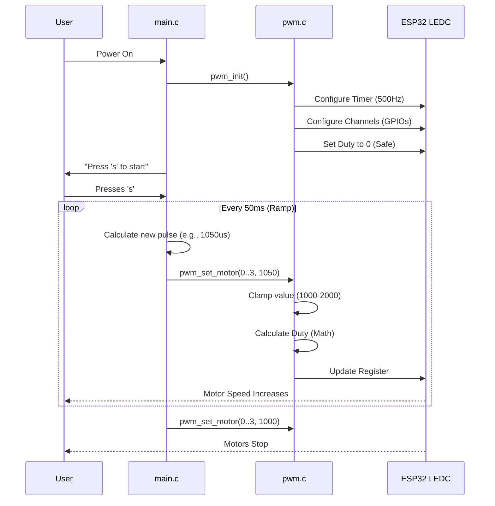

# Quadcopter PWM Driver Architecture

This document provides a comprehensive explanation of the PWM (Pulse Width Modulation) driver architecture designed for this quadcopter project. It covers the hardware peripherals used, the software design choices, the mathematical calculations, and the operational flow.

## 1. High-Level Overview

The goal of this driver is to control 4 Electronic Speed Controllers (ESCs) using the ESP32 microcontroller. ESCs require a specific type of signal: a repeating pulse where the **width** of the pulse determines the motor speed.

*   **1000 µs (1 ms)**: Motor Off / Minimum Throttle
*   **2000 µs (2 ms)**: Full Throttle
*   **Frequency**: How often this pulse repeats (500 times per second in our case).

### System Diagram

```mermaid
graph LR
    subgraph ESP32_Microcontroller
        direction TB
        App[Main Application] -->|Calls| Driver[PWM Driver (pwm.c)]
        Driver -->|Configures| LEDC[LEDC Peripheral]
        LEDC -->|Generates| T[Timer 0]
        T -->|Drives| C0[Channel 0]
        T -->|Drives| C1[Channel 1]
        T -->|Drives| C2[Channel 2]
        T -->|Drives| C3[Channel 3]
    end

    subgraph Hardware
        C0 -->|GPIO 12| ESC1[Motor 1 ESC]
        C1 -->|GPIO 13| ESC2[Motor 2 ESC]
        C2 -->|GPIO 14| ESC3[Motor 3 ESC]
        C3 -->|GPIO 27| ESC4[Motor 4 ESC]
    end
```

---

## 2. Why ESP32 LEDC Peripheral?

We use the **LEDC (LED Control)** peripheral instead of "bit-banging" (manually toggling pins) or general-purpose timers.

*   **Why?**
    *   **Hardware-Based**: The LEDC peripheral generates pulses using dedicated hardware. Once configured, it runs automatically without using the CPU. This is **non-blocking** and **deterministic**.
    *   **Precision**: It allows for high-resolution control (we are using 12-bit) which is smoother than software timers.
    *   **Glitch-Free**: Hardware generation ensures the pulses are perfectly stable, which is critical for flight stability. Jittery PWM can cause motors to twitch.

---

## 3. Configuration Deep Dive

We made specific choices for Frequency and Resolution. Here is why:

### A. Frequency: 500 Hz
*   **What is it?** The signal repeats 500 times per second. Period = 1/500 = 0.002 seconds = **2000 µs**.
*   **Why 500 Hz?**
    *   Standard analog servos/ESCs use 50 Hz.
    *   Modern multirotor ESCs support 400-500 Hz.
    *   **Benefit**: Higher frequency means the flight controller can update motor speeds faster (every 2ms instead of 20ms), leading to a more stable and responsive drone.

### B. Resolution: 12-bit
*   **What is it?** The number of discrete steps we can divide the period into.
*   **Calculation**: $2^{12} = 4096$ steps.
*   **Why 12-bit?**
    *   Our period is 2000 µs.
    *   With 4096 steps, each step is $2000 / 4096 \approx 0.488 \mu s$.
    *   **Precision**: This gives us extremely fine control over the motor speed. We have roughly 2000 steps of resolution just in the active throttle range (1000-2000µs), which is excellent for smooth flight.

---

## 4. The Math: Microseconds to Duty Cycle

The ESC understands "Microseconds" (time high), but the ESP32 LEDC register understands "Duty Cycle" (0 to 4095). We need a formula to convert them.

**The Formula:**
$$ Duty = \frac{PulseWidth(\mu s)}{Period(\mu s)} \times MaxResolution $$

Where:
*   $PulseWidth$: The desired motor command (e.g., 1500 µs).
*   $Period$: $1,000,000 / Frequency = 1,000,000 / 500 = 2000 \mu s$.
*   $MaxResolution$: $2^{12} - 1 = 4095$.

**Example Calculation for 1500 µs (Half Throttle):**
$$ Duty = \frac{1500}{2000} \times 4095 $$
$$ Duty = 0.75 \times 4095 \approx 3071 $$

**In Code (`pwm.c`):**
```c
// We use uint64_t to prevent overflow during multiplication before division
uint32_t duty = (uint32_t)(((uint64_t)pulse_width_us * (uint64_t)max_duty * (uint64_t)PWM_FREQ_HZ) / 1000000ULL);
```
*   **Why `uint64_t`?** If we multiply `2000 * 4095 * 500`, the result is `4,095,000,000`, which fits in `uint32_t` (max ~4.29 billion), but it's very close to the limit. If we increased frequency or resolution slightly, it would overflow. Using 64-bit integers ensures the math is always safe.

---

## 5. Software Architecture

### `pwm.h` (The Contract)
This file is the **Public API**. It hides the complex ESP-IDF details from the user.
*   **Macros**: Defines constants like `PWM_MOTOR_COUNT` so you can easily change the number of motors later without rewriting code.
*   **Functions**: Exposes only what is necessary: `init` and `set`.

### `pwm.c` (The Engine)
This file handles the heavy lifting.
1.  **`pwm_init()`**:
    *   **Timer Config**: Sets up the internal clock to tick at the right speed for 500Hz.
    *   **Channel Config**: Connects that timer to specific GPIO pins (12, 13, 14, 27).
2.  **`pwm_set_motor()`**:
    *   **Clamping**: This is a critical safety feature.
        ```c
        if (pulse_width_us < 1000) pulse_width_us = 1000;
        if (pulse_width_us > 2000) pulse_width_us = 2000;
        ```
        *   **Why?** If a bug in the main code sends "50000 µs", the motor might spin incorrectly or the ESC might enter programming mode. Clamping ensures the signal is always valid.

### `main.c` (The Pilot)
This demonstrates how to use the driver.
*   **Ramp Logic**:
    *   Instead of jumping from 1000 to 1900 instantly (which would flip the drone or burn the motor), we increase it slowly.
    *   **Loop**: `for` loop increments the value.
    *   **Delay**: `vTaskDelay` controls the speed of the ramp.

---

## 6. Execution Flowchart


